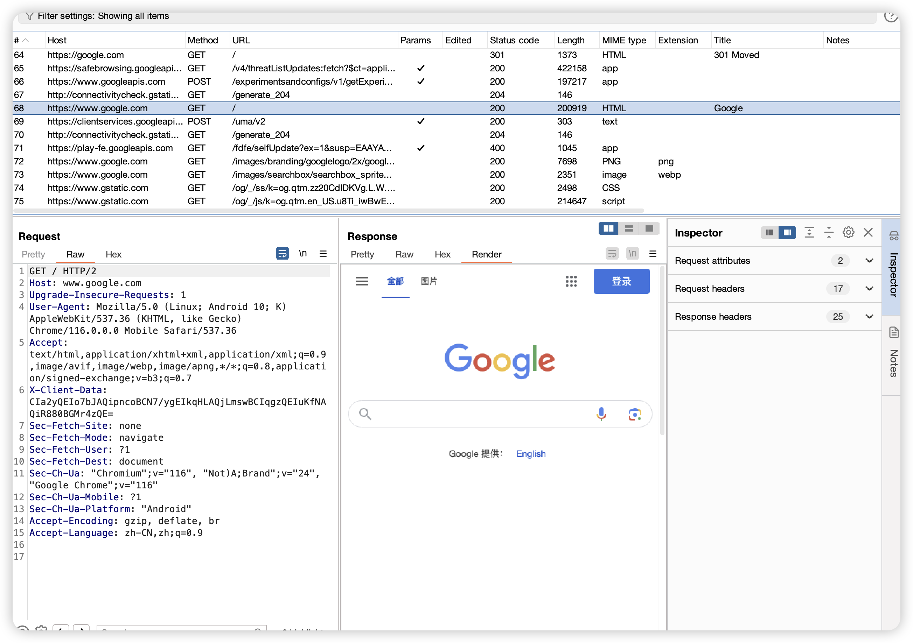

# Move Certificates
这是一个`Magisk/KernelSU/APatch`模块 用于移动用户证书到系统证书.支持`Android 7-14`
如果手机是官方镜像,可能就需要借助模块,如果是自己编译的直接`remount`手动移一下就行了.
以下是参考链接:
http://www.zhuoyue360.com/crack/60.html
https://topjohnwu.github.io/Magisk/guides.html#boot-scripts
https://github.com/Magisk-Modules-Repo/movecert
https://github.com/andyacer/movecert
https://book.hacktricks.xyz/v/cn/mobile-pentesting/android-app-pentesting/install-burp-certificate#android-14-zhi-hou 

# 使用方法

1. 导出证书后直接`push`到手机,直接安装重启即可,不需要格式转换.

## 手动直接安装证书到系统证书目录

**此方法会覆盖已有的证书，专为多台电脑和内置证书准备**

0. 如果证书已经移动过或者内置到源码中，会发现直接通过系统安装，实际证书并没有被安装进去，需要保留这种场景

1. 导出抓包软件证书 转换 证书为 pem 格式
2. `adb shell "mkdir -p  /data/local/tmp/cert"`
3. 获取证书hash

```shell
#openssl版本在1.0以上的版本的执行下面这一句---------------------
openssl x509 -inform PEM -subject_hash_old -in cacert.pem
#openssl版本在1.0以下的版本的执行下面这一句
openssl x509 -inform PEM -subject_hash -in cacert.pem
```


4. 手动修改证书(转换前)文件名为`02e06844.0`
5. `mkdir /data/local/tmp/cert`  这个cert目录需要自己创建
6. `adb push 02e06844.0  /data/local/tmp/cert/`
7. 证书推到手机后,重启即可生效，突然发现得保留这种场景。

## 使用实测


# 补充 证书转换 der to pem

```shell
# 以burp为例
openssl x509 -in burp.der -inform der -outform pem -out burp.pem
# 完成后重复 3.  - 继续
```

